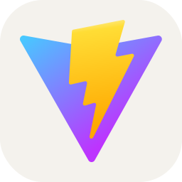
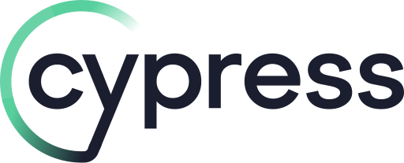
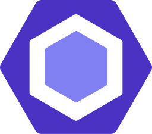
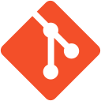

<h1 align="center">
  
</h1>

<code>🔭&nbsp;[Researcher](https://www.linkedin.com/in/alex-dolid/)</code>
<code>⚪ Community: [Metarhia](https://github.com/metarhia)</code>
<code>👷 Speciality: Software engineer / Full-Stack @[Captify](https://github.com/captify)</code> 
<code>🧑‍💻 Languages: JavaScript, TypeScript</code> 
<code>📦 Tech stack[Front-end]: React.js + Mobx/Redux+Redux-Saga + MUI + React-Query OR Vue.js + Vuex + Vuetify -> [Details](FRONTEND_DETAILS.md)</code> 
<code>📦 Tech stack[Back-end]: Node.js + NestJS/Fastify/Express(but it is bull shit) + MongoDB+Mongoose/Prisma OR PostreSQL+knex/Prisma + ElasticSearch + Redis -> [Details](BACKEND_DETAILS.md)</code> 
<code>📦 Tech stack[Desktop]: Electron.js + Electron Forge -> [Details](DESKTOP_DETAILS.md)</code> 
<code>📦 Tech stack[Mobile]: React Native + Expo -> [Details](MOBILE_DETAILS.md)</code> 
<code>💡 [Skills](SKILLS.md)</code> 
<code>💬 Telegram: [@alex_dolid](https://t.me/alex_dolid)</code>
<code>📫 [dolid.sasha@gmail.com](mailto:dolid.sasha@gmail.com)</code>

<h2 align="center">🔥 Languages & Frameworks & Tools & Abilities 🔥</h2>

  <code></code>
  <code></code>
  <code></code>
  <code></code>
  <code></code>
  <code></code>
  <code></code>
  <code></code>
  <code></code>
  <code></code>
  <code></code>
  <code></code>
  <code></code>
  <code></code>
  <code></code>
  <code></code>
  <code></code>
  <code></code>
  <code></code>
  <code></code>
  <code></code>
  <code></code>
  <code></code>
  <code></code>
  <code></code>
  <code></code>
  <code></code>
  <code></code>
  <code></code>
  <code></code>
  <code></code>
  <code></code>
  <code></code>
  <code></code>
  <code></code>
  <code></code>
  <code></code>
  <code></code>
  <code></code>
  <code></code>
  <code></code>
  <code></code>
  <code></code>
  <code></code>
  <code></code>
  <code></code>
  <code></code>
  <code></code>
  <code></code>
  <code></code>
  <code></code>
  <code></code>
  <code></code>
  <code></code>
  <code></code>
  <code></code>
  <code></code>
  <code></code>
  <code></code>
  <code></code>
  <code></code>
  <code></code>
  <code></code>
  <code></code>
  <code></code>
  <code></code>
  <code></code>
  <code></code>
  <code></code>
  <code></code>
  <code></code>
  <code></code>
  <code></code>
  <code></code>
  <code></code>
  <code></code>

